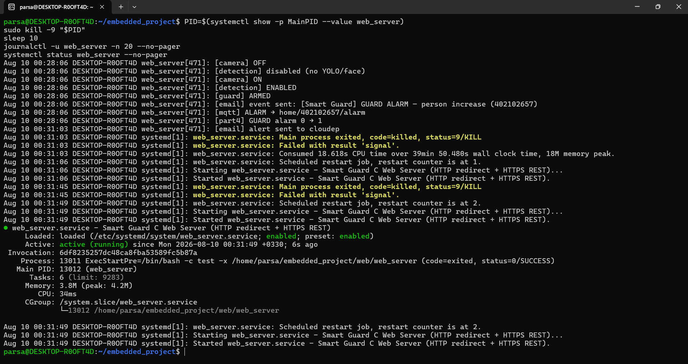
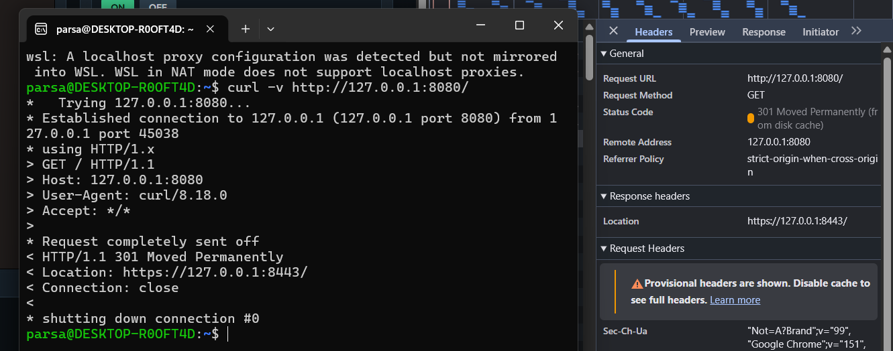
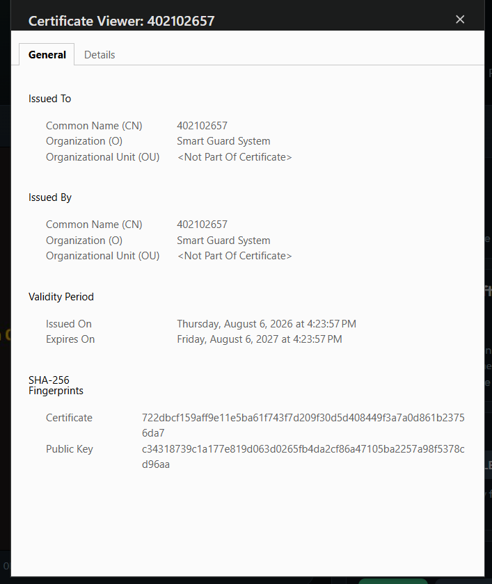
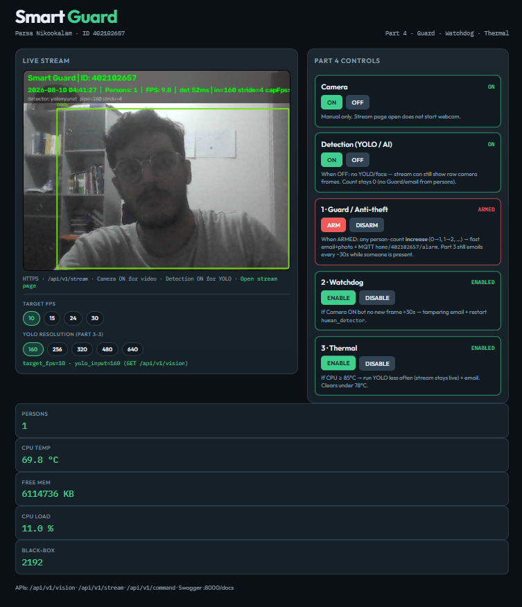

# Part 1 — Mandatory Experiments Report

| Field | Value |
|-------|--------|
| Course | Final Project — Embedded Systems |
| Project | Smart Guard System |
| Student | Parsa Nikookalam |
| Student ID | 402102657 |
| Platform | WSL Ubuntu Linux (accepted alternative to Orange Pi) |
| HTTP / HTTPS ports | `8080` / `8443` (equivalent to 80 / 443 on Orange Pi) |

This report follows the PDF table **“Mandatory experiments of the first part”** in order (**1-1** through **1-6**). Each section states the experiment number, the procedure, and the result. Figures and the autostart video are under `report/part 1/fig/`.

---

## Experiment 1-1 — Boot time with `systemd-analyze blame`

### Requirement
Reboot the board and measure boot time using `systemd-analyze blame`. The report must include a table of total boot time and the contribution of the project services (terminal screenshot).

### Procedure
On a physical Orange Pi, a full power cycle is followed by:

```bash
systemd-analyze
systemd-analyze blame
```

### Result (WSL platform note)
This implementation runs on **WSL Ubuntu**, not a physical Orange Pi. WSL startup is a lightweight virtualized boot and completes **very quickly**. There is no long cold-boot timeline comparable to U-Boot → kernel → userspace on real hardware, so a meaningful board-style `systemd-analyze blame` demonstration **cannot be presented the same way**.

**Auto-start after power-off / power-on is demonstrated in Experiment 1-3 (video).** That recording is the evidence that the application comes up without keyboard interaction. Experiment 1-1 is therefore marked as **not applicable on WSL** for the blame-table demo, with boot/autostart proof deferred to **1-3**.

Optional supporting commands after `wsl --shutdown` and reopening Ubuntu:

```bash
systemd-analyze
systemd-analyze blame | head -n 40
systemctl is-enabled web_server
systemctl is-active web_server
```

| Metric | Notes |
|--------|--------|
| Total boot time | Too short on WSL for a useful Orange Pi–style table |
| `web_server.service` share | Optional `fig/01_boot_blame.png` if captured |
| Auto-start evidence | **See Experiment 1-3 video** (`fig/03_autostart.mp4`) |

**Figure 1-1 (optional on WSL).** Terminal output of `systemd-analyze` / `blame`.


**Verdict:** N/A on WSL (boot too fast) → see Experiment **1-3**.

---

## Experiment 1-2 — Kill web server with `kill -9` (automatic restart)

### Requirement
Kill the web-server process with `kill -9`. The report must show `journalctl` logs proving the service restarted automatically.

### Procedure
The unit `web_server.service` is installed with `Restart=always`. After the main process is killed, systemd starts a new instance.

```bash
PID=$(systemctl show -p MainPID --value web_server)
sudo kill -9 "$PID"
sleep 2
journalctl -u web_server -n 30 --no-pager
systemctl status web_server --no-pager
```

### Result
The process terminated by `SIGKILL` is replaced by a new `web_server` process. Logs show the failure and the subsequent automatic start; status returns to **active (running)**.

**Figure 1-2.** `journalctl -u web_server` after `kill -9`, showing automatic restart.



**Verdict:** Pass (evidence: Figure 1-2).

---

## Experiment 1-3 — Power off / power on (autostart video)

### Requirement
Power the board off and on once. Provide a **video** of the system booting and the application starting **automatically**, with **no keyboard interaction**.

### Procedure (WSL equivalent of board power cycle)
1. From Windows: `wsl --shutdown`
2. Start screen recording (e.g. Game Bar, OBS, or phone camera).
3. Open Ubuntu (WSL) from the Start menu **without** typing `systemctl start`, `./web_server`, or similar.
4. Optionally show on camera: `systemctl is-active web_server` and/or the dashboard at `https://127.0.0.1:8443/`.
5. Evidence video: `fig/03_autostart.mp4`.

### Result
Because Experiment **1-1** cannot show a useful board boot-time table on WSL, **this video is the primary proof** that the service stack auto-starts after a full power-off / power-on cycle with no manual start commands. systemd enables `web_server` (and related units) at boot via `enable`.

**Media 1-3.** Autostart video:

`report/part 1/fig/03_autostart.mp4`

**Verdict:** Pass (evidence: Media 1-3).

---

## Experiment 1-4 — Access via HTTP (301 redirect to HTTPS)

### Requirement
Open the server address using **http** (not https). Using the browser Inspect / Network tool, provide a screenshot of the redirect to HTTPS with status **HTTP 301**.

### Procedure
1. Open DevTools → **Network**, enable **Preserve log**.
2. Navigate to `http://127.0.0.1:8080/`.
3. Observe status **301** and `Location` pointing to `https://127.0.0.1:8443/`.

The C server’s HTTP listener responds:

```http
HTTP/1.1 301 Moved Permanently
Location: https://127.0.0.1:8443/
```

### Result
Plain HTTP is permanently redirected to HTTPS. Browser Network inspect confirms **301** and the follow-up HTTPS request.

**Figure 1-4.** Browser Inspect / Network showing HTTP **301** → HTTPS.



**Verdict:** Pass (evidence: Figure 1-4).

---

## Experiment 1-5 — Self-signed certificate (CN = student ID)

### Requirement
Open the self-signed certificate of the HTML page. Screenshot certificate details and show that **Common Name (CN)** contains the student ID.

### Procedure
1. Open `https://127.0.0.1:8443/`.
2. Open the certificate viewer from the browser padlock / connection details.
3. On the General tab, read **Common Name (CN)**.

Certificate parameters used by the C HTTPS server (`web/www/server.crt`):

| Field | Value |
|-------|--------|
| Common Name (CN) | **402102657** |
| Organization (O) | Smart Guard System |
| Type | Self-signed (Issued To = Issued By) |

### Result
The certificate Common Name is the student ID **402102657**, as required.

**Figure 1-5.** Certificate Viewer showing **CN = 402102657**.



**Verdict:** Pass (evidence: Figure 1-5).

---

## Experiment 1-6 — Open the HTML page (student ID on page)

### Requirement
Open the HTML page. Screenshot the rendered webpage; it must include the student ID.

### Procedure
1. Open `https://127.0.0.1:8443/` (accept the self-signed warning if prompted).
2. Confirm the Smart Guard dashboard shows student identity.

The page is served by the C web server from `web/www/index.html` over TLS.

### Result
The dashboard loads over HTTPS and displays the student ID **402102657** (and student name).

**Figure 1-6.** Rendered HTML dashboard including student ID.



**Verdict:** Pass (evidence: Figure 1-6).

---

## Summary of mandatory experiments

| No. | Experiment | Expected output | Evidence | Verdict |
|-----|------------|-----------------|----------|---------|
| **1-1** | Reboot + `systemd-analyze blame` | Boot-time table + service share | Optional `fig/01_boot_blame.png` | **N/A on WSL** → see **1-3** |
| **1-2** | `kill -9` web server | `journalctl` auto-restart | `fig/02_kill9_restart.png` | Pass |
| **1-3** | Power off / on once | Autostart video (no keyboard) | `fig/03_autostart.mp4` | Pass |
| **1-4** | Open with `http` | Inspect: **301** → HTTPS | `fig/04_http_301_inspect.png` | Pass |
| **1-5** | Open self-signed cert | CN = student ID | `fig/05_cert_subject.png` | Pass |
| **1-6** | Open HTML page | Page with student ID | `fig/06_html_dashboard.png` | Pass |

---

## Evidence files (`fig/`)

| File | Experiment |
|------|------------|
| `01_boot_blame.png` | 1-1 (optional on WSL) |
| `02_kill9_restart.png` | 1-2 |
| `03_autostart.mp4` | 1-3 |
| `04_http_301_inspect.png` | 1-4 |
| `05_cert_subject.png` | 1-5 |
| `06_html_dashboard.png` | 1-6 |

---

## Implementation notes (Part 1)

1. **C web server** — `web/web_server` (sockets + OpenSSL + pthreads).  
2. **HTML dashboard** — `web/www/index.html` on `GET /`.  
3. **HTTPS** — self-signed cert via `scripts/gen_ssl.sh`, **CN = 402102657**.  
4. **HTTP → HTTPS** — 301 redirect from port 8080 to 8443.  
5. **systemd** — `services/web_server.service` with `Restart=always` and boot enable.

---

## References

- Course PDF: *Final Project — Embedded Systems*, table “Mandatory experiments of the first part”  
- `web/src/server.c`, `services/web_server.service`, `scripts/gen_ssl.sh`

---

## Conclusion (Part 1)

Part 1 delivers a **C HTTPS appliance** with self-signed identity (**CN = 402102657**), permanent HTTP→HTTPS redirect, HTML dashboard, and **systemd autostart** (`Restart=always`). On WSL, boot-blame (1-1) is N/A; autostart after `wsl --shutdown` is proven by Media 1-3. Experiments **1-2 … 1-6** are complete with evidence under `fig/`.
