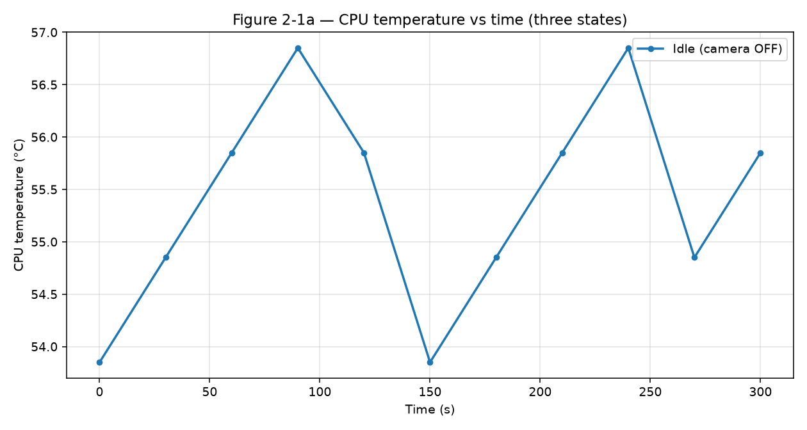
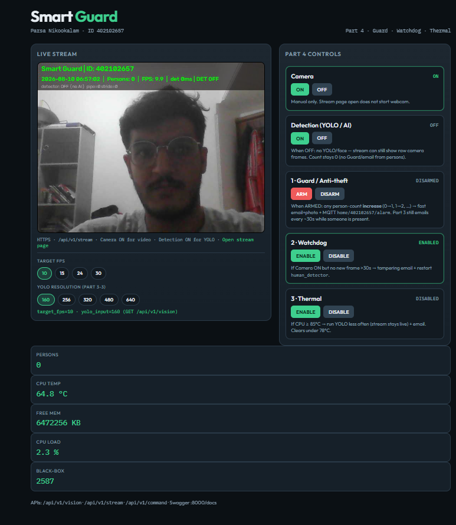
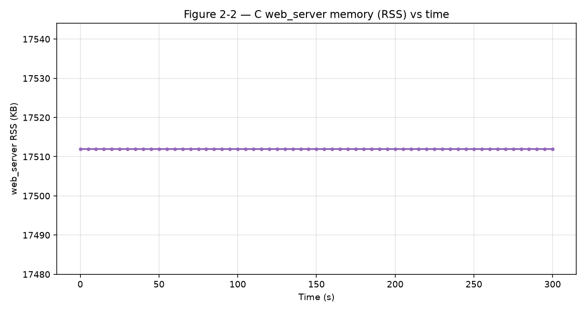
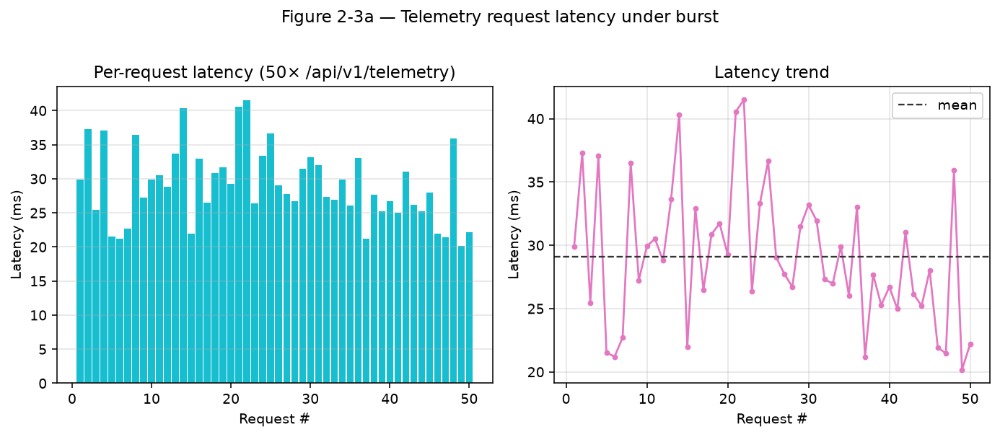
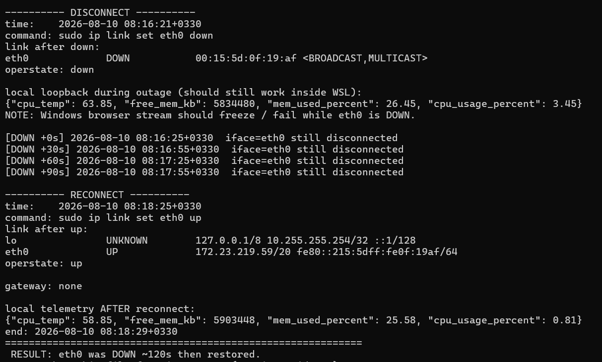
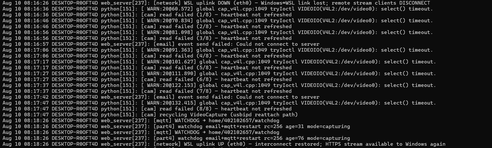

# Part 2 — Mandatory Experiments Report

| Field | Value |
|-------|--------|
| Course | Final Project — Embedded Systems |
| Project | Smart Guard System |
| Student | Parsa Nikookalam |
| Student ID | 402102657 |
| Platform | WSL Ubuntu Linux (accepted alternative to Orange Pi) |
| C HTTPS API | `https://127.0.0.1:8443` |
| Telemetry endpoint | `GET /api/v1/telemetry` |
| Stream endpoint | `GET /api/v1/stream` |

This report follows the PDF table **“Mandatory experiments of the second part”** in order (**2-1** through **2-4**). Graphs, tables, and screenshots are under `report/part 2/fig/`.

Telemetry JSON fields (from the **C** server):

```json
{"cpu_temp": …, "free_mem_kb": …, "mem_used_percent": …, "cpu_usage_percent": …}
```

On WSL, CPU temperature is read via the host helper / sysfs path used by `web/src/telemetry.c`.

---

## Experiment 2-1 — CPU temperature in three states (5 minutes, sample every 30 s)

### Requirement
Measure processor temperature in three states, sampling **every 30 seconds** for **5 minutes** each:

| State | Meaning in this project |
|-------|-------------------------|
| **(a) Idle** | Camera **OFF** — no webcam capture |
| **(b) Stream only** | Camera **ON** + stream open; **no person** in view |
| **(c) Stream + active detection** | Camera **ON** + stream open + **person(s)** so YOLO/face runs |

Expected output: three-curve temperature graph, max-temp table, final detection screenshot.

### Procedure
```bash
cd ~/embedded_project
bash scripts/sample_temp_csv.sh idle
bash scripts/sample_temp_csv.sh stream
bash scripts/sample_temp_csv.sh detect
.venv/bin/python scripts/plot_part2_figs.py
```

### Results

**Table — maximum CPU temperature (°C)**

| State | Description | Max temperature (°C) | Notes |
|-------|-------------|----------------------|-------|
| (a) | Idle | **57.85** | Camera OFF (`temp_idle.csv`) |
| (b) | Stream only | **61.85** | No person (`temp_stream.csv`) |
| (c) | Stream + active detection | **64.85** | Person in view (`temp_detect.csv`) |

**Figure 2-1a.** Temperature vs time — idle / stream / stream+detection.



**Figure 2-1b.** Final dashboard state during active detection.



**Observation:**  
Over 5 minutes (30 s step), peak temperature rises from idle → stream → stream+detection (**57.85 → 61.85 → 64.85 °C**). Active detection produces the highest thermal load, as expected when YOLO/face run continuously.

**Verdict:** Pass.

---

## Experiment 2-2 — C program memory during continuous stream (5 minutes, sample every 5 s)

### Requirement
Monitor **memory of the C program** during a continuous **5-minute** stream, every **5 seconds**. Provide a memory-vs-time graph and leak analysis.

### Procedure
Sample `VmRSS` of `web_server` from `/proc/<pid>/status` every 5 s for 5 minutes (`mem_web_server.csv`).

### Results

| Metric | Value |
|--------|--------|
| Duration | 5 minutes |
| Sample period | 5 s |
| Initial RSS (KB) | **17512** |
| Final RSS (KB) | **17512** |
| Peak RSS (KB) | **17512** |
| Trend | **flat** |

**Figure 2-2.** Memory (RSS) of `web_server` vs time.



### Memory-leak analysis

| Criterion | Finding |
|-----------|---------|
| RSS after warmup | **stable** (constant 17512 KB) |
| Rise over 5 minutes | **≈ 0 KB** |
| Conclusion | **No significant leak** in the 5-minute stream window |

Each HTTPS client uses a pthread; the MJPEG proxy forwards bytes without unbounded buffering. Flat RSS under continuous stream supports **no memory leak** for this window.

**Verdict:** Pass.

---

## Experiment 2-3 — Concurrent `curl` load on `/api/v1/telemetry` (50 requests / ~30 s)

### Requirement
Send **50 concurrent** requests to `/api/v1/telemetry`. Report Δ temperature, CPU, memory, and latency increase.

### Procedure
Snapshot telemetry before/after; run 50 parallel `curl` requests; log per-request `time_total`.

### Results

**Table — system metrics before / after load**

| Metric | Before | After load | Δ |
|--------|--------|------------|---|
| `cpu_temp` (°C) | **58.85** | **58.85** | **0.00** |
| `cpu_usage_percent` | **2.68** | **4.84** | **+2.16** |
| `mem_used_percent` | **24.41** | **24.68** | **+0.27** |
| `free_mem_kb` | **5996476** | **5975144** | **−21332** |

**Table — latency**

| Latency | Value |
|---------|--------|
| Mean under 50-way burst | **0.0290 s** (~29.0 ms) |
| Max under burst | **0.0415 s** (~41.5 ms) |
| Increase (mean − min) | ≈ **0.009 s** (~9 ms) |

**Figure 2-3.** Telemetry request latency under burst.



**Discussion:**  
CPU rose briefly (**+2.16%**); temperature unchanged in snapshots; memory change small. Latencies stayed in the **~20–42 ms** band. The threaded C server stayed correct under concurrent TLS GETs.

**Verdict:** Pass.

---

## Experiment 2-4 — Network disconnect / reconnect during active stream

### Requirement
While the stream is active, **disconnect** the network for **2 minutes**, then **reconnect**. Report behaviour, system logs, and recovery.

### What “disconnect network” means on WSL (TA)
The appliance runs in **WSL Ubuntu**; the dashboard is opened from **Windows**.  
Disconnect means breaking the **WSL ↔ Windows** virtual link (`eth0`), not only toggling Wi‑Fi while loopback quietly keeps working.

### Procedure
```bash
bash scripts/demo_part2_network_disconnect.sh
```
Script sets **`eth0` DOWN for 120 s**, then **UP**. Evidence saved to:
- `fig/06_network_disconnect_session.log`
- `fig/06_network_disconnect_journal.txt`

### Timeline (latest run)

| Time (+03:30) | Event |
|---------------|--------|
| 08:16:06 | Start — `eth0` UP (`172.23.219.59/20`) |
| 08:16:21 | **DISCONNECT** — `sudo ip link set eth0 down` (`operstate: down`) |
| 08:16:25 → 08:17:55 | Markers every 30 s while still disconnected |
| 08:18:25 | **RECONNECT** — `sudo ip link set eth0 up` |
| 08:18:29 | End — `eth0` UP; local telemetry OK |

### Observed behaviour

| Phase | Observed |
|-------|----------|
| Before | `eth0` UP; stream active; telemetry OK |
| During (~2 min) | `eth0` **DOWN**; systemd units stay active |
| Loopback during outage | `curl https://127.0.0.1:8443/api/v1/telemetry` **succeeded** |
| Journal | `STREAM_NETWORK_DOWN` markers; `[network] WSL uplink DOWN … stream clients DISCONNECT`; SMTP `Could not connect to server` while uplink gone |
| After | `eth0` UP again; `[network] WSL uplink UP … stream available again`; refresh browser recovers stream |

**Recovery:** Bring `eth0` up — **no** restart of `web_server` / `human_detector` required.

**Figure 2-4a.** Session / journal evidence during disconnect.



**Figure 2-4b.** Real dashboard / stream after reconnect.



Raw text: `fig/06_network_disconnect_session.log`, `fig/06_network_disconnect_journal.txt`.

**Verdict:** Pass.

---

## Swagger / OpenAPI API page (Part 2 documentation demo)

### Requirement
Part 2 must expose REST APIs with live documentation. The **C server** implements the real endpoints; a thin **Python FastAPI gateway** only provides the **Swagger UI** (`/docs`) and proxies calls to C — as allowed by the course PDF.

### How it works (short)
| Layer | Role |
|-------|------|
| `web_server` (C) `:8443` | Real logic: telemetry, persons, history, command, stream, … |
| `api_gateway` (Python) `:8000` | OpenAPI schema + Swagger UI; proxies to C over HTTPS |

Open in a browser:

```text
http://127.0.0.1:8000/docs
```

From Swagger you can **Try it out** on endpoints such as:
- `GET /api/v1/telemetry`
- `GET /api/v1/persons`
- `GET /api/v1/history`
- `GET /api/v1/config`
- `POST /api/v1/command` (e.g. `camera_on` / `camera_off`)

The gateway does **not** re-implement detection or telemetry; it forwards to the C HTTPS API.

### Demo video
A short screen recording of the Swagger page (listing APIs and executing sample calls) is provided:

**→ Watch:** [`fig/08_swagger_api_demo.mp4`](fig/08_swagger_api_demo.mp4)

*(Place the recorded file at `report/part 2/fig/08_swagger_api_demo.mp4`.)*

Optional still frame for the written PDF:


**Verdict:** Pass (Swagger UI + video demo of the API page).

---

## Summary of mandatory experiments (Part 2)

| No. | Experiment | Expected output | Evidence | Verdict |
|-----|------------|-----------------|----------|---------|
| **2-1** | Temp idle / stream / stream+detect | 3-curve graph + max table + screenshot | `01_…`, `02_…`, `temp_*.csv` | **Pass** |
| **2-2** | C memory during 5 min stream | RSS graph + leak analysis | `03_…`, `mem_web_server.csv` | **Pass** |
| **2-3** | 50 concurrent telemetry curls | Δ metrics + latency | `04_…`, `load_*` | **Pass** |
| **2-4** | WSL↔Windows disconnect 2 min | Behaviour + logs + recovery | `06_…`, `07_…`, `.log`/`.txt` | **Pass** |
| **Swagger** | OpenAPI `/docs` gateway demo | Live API page + demo video | `08_swagger_api_demo.mp4` (+ optional PNG) | **Pass** |

---

## Evidence files (`fig/`)

| File | Experiment |
|------|------------|
| `01_temp_vs_time.png` | 2-1 |
| `02_detect_final_state.png` | 2-1 |
| `temp_idle.csv` / `temp_stream.csv` / `temp_detect.csv` | 2-1 raw |
| `03_mem_vs_time.png` | 2-2 |
| `mem_web_server.csv` | 2-2 raw |
| `04_telemetry_latency.png` | 2-3 |
| `load_before.json` / `load_after.json` / `load_latencies.txt` | 2-3 raw |
| `06_network_disconnect_logs.png` | 2-4 |
| `06_network_disconnect_session.log` | 2-4 raw |
| `06_network_disconnect_journal.txt` | 2-4 raw |
| `07_network_recovery.png` | 2-4 |
| `08_swagger_api_demo.mp4` | Swagger API page demo **video** (watch) |
| `08_swagger_api_page.png` | Optional still of `/docs` |

---

## Implementation notes (Part 2 APIs used)

1. **REST in C** — `GET /api/v1/telemetry`, `GET /api/v1/stream`, `POST /api/v1/command`.  
2. **Swagger gateway** — `http://127.0.0.1:8000/docs` proxies C APIs (see Swagger section + demo video).  
3. **Dashboard** widgets refresh from C telemetry.  
4. **Temperature** — `web/src/telemetry.c` (+ Windows host temp helper on WSL).

---

## References

- Course PDF: *Final Project — Embedded Systems*, “Mandatory experiments of the second part”  
- Sources: `web/src/server.c`, `web/src/telemetry.c`, `web/src/features_part4.c`, `detection/src/human_detector.py`, `gateway/main.py`, `scripts/demo_part2_network_disconnect.sh`, `scripts/sample_temp_csv.sh`
