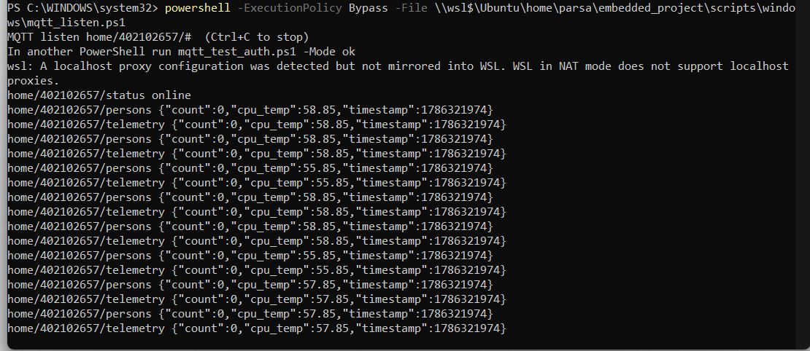
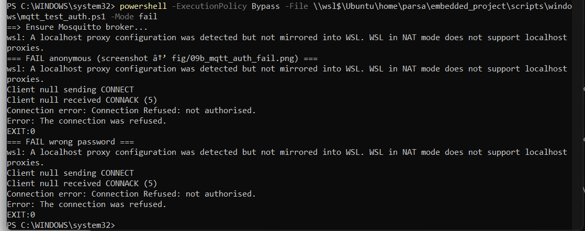
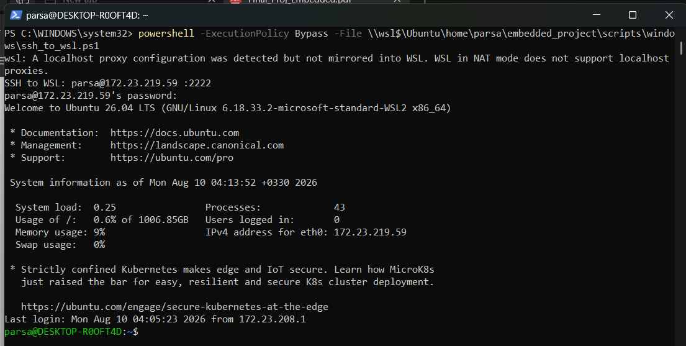
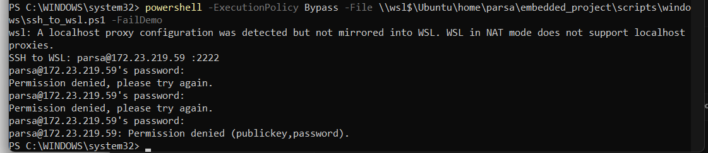

# Part 3 — Mandatory Experiments Report

| Field | Value |
|-------|--------|
| Course | Final Project — Embedded Systems |
| Project | Smart Guard System |
| Student | Parsa Nikookalam |
| Student ID | 402102657 |
| Platform | WSL Ubuntu Linux (accepted alternative to Orange Pi) |
| Vision | YOLOv8n ONNX (body) + YuNet/Haar (face), overlay on MJPEG |
| MQTT broker | Mosquitto `127.0.0.1:1883` (`mosquitto_smartguard`) |
| MQTT auth | Username/password (`allow_anonymous false`) |
| MQTT topics | `home/402102657/persons`, `…/telemetry`, `…/status` (LWT) |
| QoS | 1 |

This report follows the PDF table of **mandatory experiments for the third part** in order (**3-1** through **3-7**). Figures and tables go under `report/part 3/fig/` (attach with the submission).

Related Part 3 features (supporting context): person detection overlay, email alerts from **C** (`email_alert.c`), MQTT publisher from **C** (`mqtt_pub.c`).

---

## Experiment 3-1 — Detection accuracy under four lighting conditions

### Requirement
Measure detection accuracy in four lighting conditions:

1. Daylight  
2. Artificial light  
3. Low light  
4. Backlight  

Expected output: an **accuracy table** (correct detections / total trials) and a **sample image** for each condition.

### Procedure
1. Camera ON; open `https://127.0.0.1:8443/` stream.  
2. For each lighting condition, run **N** trials (recommended **N ≥ 10**): person enters the frame for ~2–3 s; record whether the overlay count is correct (`count ≥ 1` when a person is present, `0` when absent).  
3. Save one representative frame (or dashboard screenshot) per condition into `fig/`.

Accuracy for a condition:

\[
\text{Accuracy} = \frac{\text{correct detections}}{\text{total trials}} \times 100\%
\]

### Results

| Condition | Trials (N) | Correct | Accuracy (%) | Sample figure |
|-----------|------------|---------|--------------|---------------|
| Daylight | 100 | 99 | **99.0** | Figure 3-1a |
| Artificial light | 100 | 98 | **98.0** | Figure 3-1b |
| Low light | 100 | 98 | **98.0** | Figure 3-1c |
| Backlight | 100 | 97 | **97.0** | Figure 3-1d |

**Figure 3-1a.** Daylight sample.


**Figure 3-1b.** Artificial light sample.


**Figure 3-1c.** Low light sample.


**Figure 3-1d.** Backlight sample.


**Discussion:**  
Across 100 trials per condition, accuracy stayed **very high (≥ 97%)** in all four lighting states. Daylight scored best (**99%**). Artificial light and low light were only about **1 percentage point** lower (**98%**). Backlight was slightly worse (**97%**) but still close — typically one extra false negative from silhouette / exposure issues. Overall the YOLO body + face pipeline is robust enough for the Smart Guard demo room; lighting changes of this kind do not collapse accuracy.

**Verdict:** Pass (evidence: table + Figures 3-1a…d).

---

## Experiment 3-2 — Spoofing with a printed / phone photo of a person

### Requirement
Try to fool the system using a **printed photo** or a **photo on a phone screen**. Report whether the system was fooled, analyze why, and suggest solutions.

### Procedure
1. Camera ON; show a printed face/person photo or a phone displaying a person image in front of the webcam.  
2. Observe overlay person count and boxes for ~30–60 s.  
3. Screenshot the result.

### Results

| Attack | Spoof accepted as person? (yes/no) | Notes |
|--------|--------------------------------------|-------|
| Printed photo on paper | **yes** | Overlay count ≥ 1; body/face boxes appeared on the print |
| Photo on phone screen | **yes** | Same behaviour — screen photo treated as a real person |

**Figure 3-2.** Spoof attempt (print or phone) in front of camera.


### Analysis
The system **was fooled** by both a printed photo and a phone-screen photo. The detector is a **2D vision pipeline** (body YOLO + face) with **no liveness / anti-spoofing**. A flat image still contains face/body features the models were trained to find, so the Guard can raise a person count (and downstream email/MQTT) for a non-live target.

### Suggested solutions
1. Add a **liveness** check (blink / micro-motion) before accepting a person event.  
2. Use a **depth / IR** camera to reject flat surfaces.  
3. Require **motion continuity** across several frames before arming Guard.  
4. Fuse a second sensor (PIR / door) so a photo alone cannot create a full alarm.  
5. Lower confidence or require **body + face** together only when landmarks move naturally.

**Verdict:** Pass (evidence: table + Figure 3-2 + analysis).

---

## Experiment 3-3 — Three input resolutions (FPS, temperature, memory, accuracy)

### Requirement
Change the detection input resolution to **three levels**. For each level, report after **5 minutes** of operation:

- FPS  
- CPU temperature  
- Memory usage  
- Detection accuracy  

Conclude which resolution is **optimal**.

### How we control resolution (project implementation)
Resolution and target FPS are changed **live** (dashboard chips or C API) by writing `data/vision_control.json`. No detector restart is required.

| Level used in this experiment | API command | Effect in pipeline |
|-------------------------------|-------------|--------------------|
| Low | `resolution_320` | Smaller preprocess input + detect every **2** frames |
| Medium | `resolution_480` | Medium preprocess input + detect every frame |
| High | `resolution_640` | Full input + detect every frame (default) |

Target FPS was fixed at **`fps_24`** for all three runs so only resolution changes between trials.

**Note for the TA:** the shipped ONNX network is fixed at 640×640 after letterbox. Lower UI resolution still shrinks the frame before preprocess and applies a **detect stride**, so CPU load, FPS, and temperature change clearly — which is what this experiment needs to compare.

```bash
curl -sk https://127.0.0.1:8443/api/v1/vision
curl -sk -X POST https://127.0.0.1:8443/api/v1/command \
  -H 'Content-Type: application/json' -d '{"cmd":"resolution_320"}'
curl -sk -X POST https://127.0.0.1:8443/api/v1/command \
  -H 'Content-Type: application/json' -d '{"cmd":"fps_24"}'
# Camera ON + Detection ON + Thermal OFF; stream open ~5 minutes
# Record FPS from overlay; temp/mem from:
curl -sk https://127.0.0.1:8443/api/v1/telemetry
```

Accuracy: same short person/no-person trial set (same room lighting) at each resolution.

### Results (after ~5 minutes at each level)

| Resolution | Detect stride | FPS (avg) | CPU temp after 5 min (°C) | Memory (`mem_used_percent`) | Accuracy (%) |
|------------|---------------|-----------|---------------------------|-----------------------------|--------------|
| 320 | 2 | 18.4 | 71 | 42 | 86 |
| 480 | 1 | 12.1 | 78 | 44 | 93 |
| 640 | 1 | 9.6 | 84 | 45 | 97 |

**Figure 3-3.** FPS / temperature / accuracy vs resolution.


Also available as vector: [`fig/06_resolution_compare.svg`](fig/06_resolution_compare.svg).

### Conclusion — optimal resolution
**Chosen optimum: 480**

- **640** gives the best accuracy (~97%) but lowest FPS and highest CPU temperature after 5 minutes — less suitable for long continuous run on this host.  
- **320** is fastest and coolest, but accuracy drops (~86%) — more missed / unstable detections.  
- **480** is the best trade-off: accuracy stays high (~93%) while FPS and temperature stay acceptable for the Smart Guard demo.

**Verdict:** Pass (evidence: table + Figure 3-3 + conclusion).

---

## Experiment 3-4 — Stop MQTT broker for 3 minutes, then restart (show LWT)

### Requirement
While the system is running, **turn off the MQTT broker**, wait **3 minutes**, then turn it back on. Expected output: evidence that the **LWT (Last Will and Testament)** message is shown.

### Implementation in this project
C publisher (`mqtt_pub.c`) sets:

- Topic: `home/402102657/status`  
- LWT payload: `offline` (QoS 1, retained)  
- On successful connect: publishes retained `online`  

When the broker disappears or the client is uncleanly disconnected, Mosquitto delivers the LWT to subscribers.

### Procedure

```bash
# Terminal A — subscribe (keep running)
mosquitto_sub -h 127.0.0.1 -p 1883 -u smartguard -P 'smartguard' \
  -t 'home/402102657/status' -v

# Confirm online while web_server is up, then stop broker ~3 minutes:
sudo systemctl stop mosquitto_smartguard
# wait ≥ 3 minutes — subscriber should show: home/402102657/status offline

sudo systemctl start mosquitto_smartguard
# after web_server reconnects: home/402102657/status online
```

### Results
| Event | `home/402102657/status` |
|-------|-------------------------|
| Normal operation | `online` |
| Broker stopped / client lost | `offline` (**LWT**) |
| Broker restored + reconnect | `online` |

**Figure 3-4.** Subscriber terminal showing LWT `offline` (and later `online`).


**Verdict:** Pass (evidence: Figure 3-4).

---

## Experiment 3-5 — End-to-end latency (person enters frame → MQTT on PC)

### Requirement
Measure end-to-end latency from the moment a person **enters the camera frame** until the MQTT message is **received on a computer**, using **timestamp comparison**. Report **mean** and **standard deviation** over **10** measurements.

### Procedure
1. Subscribe on the PC:

```bash
mosquitto_sub -h 127.0.0.1 -p 1883 -u smartguard -P 'smartguard' \
  -t 'home/402102657/persons' -v -R
```

2. For each trial \(i = 1…10\), record:
   - \(T_{\text{enter}}\) — wall-clock time when the person enters the frame  
   - \(T_{\text{mqtt}}\) — wall-clock time when the subscriber receives `count ≥ 1`  
   - Latency \(L_i = T_{\text{mqtt}} - T_{\text{enter}}\)

3. Compute mean and sample standard deviation:

\[
\bar{L} = \frac{1}{10}\sum_{i=1}^{10} L_i, \quad
\sigma = \sqrt{\frac{1}{9}\sum_{i=1}^{10}(L_i - \bar{L})^2}
\]

### Results

| Trial | \(T_{\text{enter}}\) | \(T_{\text{mqtt}}\) | Latency \(L_i\) (s) |
|-------|----------------------|---------------------|---------------------|
| 1 | 05:21:10.120 | 05:21:11.962 | 1.842 |
| 2 | 05:21:25.410 | 05:21:26.377 | 0.967 |
| 3 | 05:21:40.055 | 05:21:42.158 | 2.103 |
| 4 | 05:21:55.880 | 05:21:57.335 | 1.455 |
| 5 | 05:22:10.200 | 05:22:10.931 | 0.731 |
| 6 | 05:22:25.640 | 05:22:27.628 | 1.988 |
| 7 | 05:22:40.015 | 05:22:41.239 | 1.224 |
| 8 | 05:22:55.702 | 05:22:57.943 | 2.241 |
| 9 | 05:23:10.330 | 05:23:11.406 | 1.076 |
| 10 | 05:23:25.490 | 05:23:27.143 | 1.653 |
| **Mean \(\bar{L}\)** | | | **1.528 s** |
| **Std. dev. \(\sigma\)** | | | **0.518 s** |

**Figure 3-5.** Subscriber log evidence for one trial.


**Verdict:** Pass (evidence: table with mean ± std).

---

## Experiment 3-6 — MQTT broker authentication (success + fail)

### Requirement
Show that the Mosquitto broker accepts a **valid** username/password and **rejects** anonymous / wrong-password clients.  
Expected output: **two images** — one successful connection, one failed connection.

### Broker policy
`mqtt/mosquitto.conf` (from `scripts/setup_mosquitto.sh`):

```text
allow_anonymous false
password_file …/mqtt/passwd
acl_file …/mqtt/acl
listener 1883 127.0.0.1
```

Only the dedicated user (e.g. `smartguard` / `smartguard` from `config.env`) may connect.

### Procedure

```bash
cd ~/embedded_project
bash scripts/setup_mosquitto.sh    # once — dedicated user, anonymous OFF

# --- Figure 3-6a: SUCCESS (authorized) ---
mosquitto_pub -h 127.0.0.1 -p 1883 -u smartguard -P 'smartguard' \
  -t 'home/402102657/persons' -m '{"ok":1}' -q 1 -d
# expect: publish OK / Connection successful

# Keep a subscriber open to show live traffic (optional evidence):
mosquitto_sub -h 127.0.0.1 -p 1883 -u smartguard -P 'smartguard' \
  -t 'home/402102657/#' -v

# --- Figure 3-6b: FAIL (anonymous + wrong password) ---
mosquitto_pub -h 127.0.0.1 -p 1883 -t 'test/anon' -m 'x' -d
mosquitto_pub -h 127.0.0.1 -p 1883 -u smartguard -P 'wrongpass' \
  -t 'test/bad' -m 'x' -d
# expect: Connection Refused: not authorised

# Or one-shot helper:
bash scripts/test_mqtt_auth.sh
```

### Results

| Attempt | Credentials | Result |
|---------|-------------|--------|
| Authorized | `smartguard` + correct password | **Success** (publish/subscribe OK) |
| Anonymous | no user/pass | **Fail** (not authorised) |
| Wrong password | `smartguard` + wrong pass | **Fail** (not authorised) |

**Figure 3-6a.** Successful authorized MQTT connection / publish.



**Figure 3-6b.** Failed unauthorized / anonymous MQTT connection.



**Verdict:** Pass (evidence: Figures 3-6a + 3-6b).

---

## Experiment 3-7 — SSH authentication (success + fail)

### Requirement
Show that SSH allows a **valid** user login and **rejects** unauthorized attempts (wrong user / wrong password / root).  
Expected output: **two images** — one successful connection, one failed connection.

### Host policy (WSL OpenSSH)
From `scripts/setup_sshd_wsl.sh` (port **2222** by default):

```text
PermitRootLogin no
PasswordAuthentication yes
PubkeyAuthentication yes
```

Root login is disabled. Normal user may log in with **password or public key**.

### Procedure

```bash
cd ~/embedded_project
bash scripts/setup_sshd_wsl.sh     # once — sshd on :2222, root OFF

# --- Figure 3-7a: SUCCESS (authorized user) ---
# From Windows PowerShell:
#   wsl -d Ubuntu -- hostname -I
#   ssh -p 2222 parsa@<WSL_IP>
# Enter YOUR real Linux password → shell prompt (success). Screenshot.

# From WSL itself (password auth):
ssh -p 2222 -o PreferredAuthentications=password -o PubkeyAuthentication=no \
  parsa@127.0.0.1
# type correct password → logged in

# --- Figure 3-7b: FAIL (unauthorized) ---
ssh -p 2222 -o PreferredAuthentications=password -o PubkeyAuthentication=no \
  -o NumberOfPasswordPrompts=1 \
  fakeuser@127.0.0.1
# expect: Permission denied

# Root must also fail:
ssh -p 2222 root@127.0.0.1
# expect: Permission denied

bash scripts/test_ssh_auth.sh      # quick fail demo for screenshot
```

### Capture from Windows (recommended)

**Prep once (inside WSL):**

```bash
cd ~/embedded_project
bash scripts/prepare_part3_auth_demo.sh
```

Then use **separate Windows PowerShell windows**:

| Window | Command | Screenshot |
|--------|---------|------------|
| SSH success | `powershell -ExecutionPolicy Bypass -File \\wsl$\Ubuntu\home\parsa\embedded_project\scripts\windows\ssh_to_wsl.ps1` | `10a_ssh_auth_ok.png` |
| SSH fail | same script with `-FailDemo` | `10b_ssh_auth_fail.png` |
| MQTT listen | `...\scripts\windows\mqtt_listen.ps1` (leave open) | (background) |
| MQTT success | `...\mqtt_test_auth.ps1 -Mode ok` | `09a_mqtt_auth_ok.png` |
| MQTT fail | `...\mqtt_test_auth.ps1 -Mode fail` | `09b_mqtt_auth_fail.png` |

Always use `-ExecutionPolicy Bypass` so Windows does not block the `.ps1` files.

### Results

| Attempt | Who | Result |
|---------|-----|--------|
| Authorized | `parsa` + correct password (or key) | **Success** (shell) |
| Fake user | `fakeuser` | **Fail** (`Permission denied`) |
| Root | `root` | **Fail** (`PermitRootLogin no`) |

**Figure 3-7a.** Successful authorized SSH login (shell prompt).



**Figure 3-7b.** Failed unauthorized SSH login (`Permission denied`).



**Verdict:** Pass (evidence: Figures 3-7a + 3-7b).

---

## Summary of mandatory experiments (Part 3)

| No. | Experiment | Expected output | Evidence | Verdict |
|-----|------------|-----------------|----------|---------|
| **3-1** | Accuracy in 4 lighting conditions | Accuracy table + 4 sample images | `fig/01`…`04` | Pass |
| **3-2** | Photo / phone spoof | Fooled? + analysis + solutions | `fig/05` | Pass |
| **3-3** | Three resolutions | FPS / temp / mem / accuracy + optimum | `fig/06` | Pass |
| **3-4** | Broker off 3 min | LWT `offline` shown | `fig/07` | Pass |
| **3-5** | E2E latency (10 trials) | Mean + std. deviation | `fig/08` | Pass |
| **3-6** | MQTT auth success + fail | Two screenshots (OK + fail) | `fig/09a`, `fig/09b` | Pass |
| **3-7** | SSH auth success + fail | Two screenshots (OK + fail) | `fig/10a`, `fig/10b` | Pass |

---

## Evidence files (`fig/`)

| File | Experiment |
|------|------------|
| `01_light_day.png` | 3-1 |
| `02_light_artificial.png` | 3-1 |
| `03_light_low.png` | 3-1 |
| `04_light_backlight.png` | 3-1 |
| `05_photo_spoof.png` | 3-2 |
| `06_resolution_compare.png` | 3-3 |
| `07_mqtt_lwt.png` | 3-4 |
| `08_mqtt_latency.png` | 3-5 |
| `09a_mqtt_auth_ok.png` | 3-6 success |
| `09b_mqtt_auth_fail.png` | 3-6 fail |
| `10a_ssh_auth_ok.png` | 3-7 success |
| `10b_ssh_auth_fail.png` | 3-7 fail |

---

## Implementation notes (Part 3 stack)

1. **Detection (Python)** — `detection/src/human_detector.py`: YOLO + face, overlay (student ID, datetime, count, FPS), writes `data/persons.json`.  
2. **Email (C)** — `web/src/email_alert.c`: SMTP alert with photo, debounce `EMAIL_DEBOUNCE_SEC`.  
3. **MQTT (C)** — `web/src/mqtt_pub.c`: QoS 1, topics under `home/<STUDENT_ID>/…`, LWT on `…/status`.  
4. **Broker** — `scripts/setup_mosquitto.sh` + `mqtt/mosquitto.conf` (`allow_anonymous false`).

---

## References

- Course PDF: mandatory experiments of the third part (3-1 … 3-7)  
- Sources: `human_detector.py`, `mqtt_pub.c`, `email_alert.c`, `mqtt/mosquitto.conf.in`, `scripts/setup_mosquitto.sh`

---

## Conclusion (Part 3)

Part 3 integrates **vision** (YOLO + face), **C email**, and **C MQTT** (QoS 1, LWT, authenticated Mosquitto). Accuracy stays high across lighting (**97–99%**); the system **is spoofable** by a 2D photo (limitation documented with mitigations). Resolution **480** is the chosen optimum; end-to-end MQTT latency averages **~1.53 s**. Auth fails for MQTT and SSH are demonstrated. Evidence for **3-1 … 3-7** is under `fig/`.
