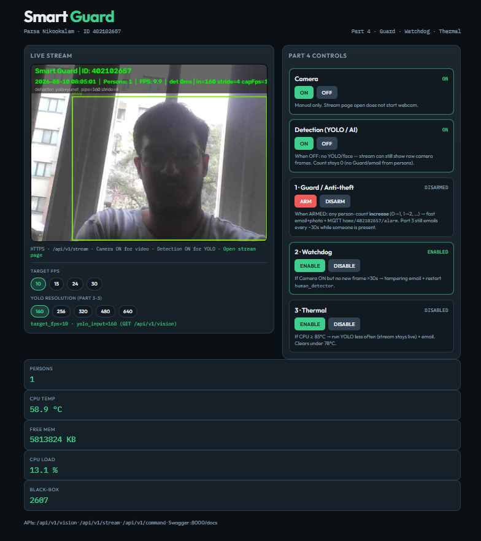
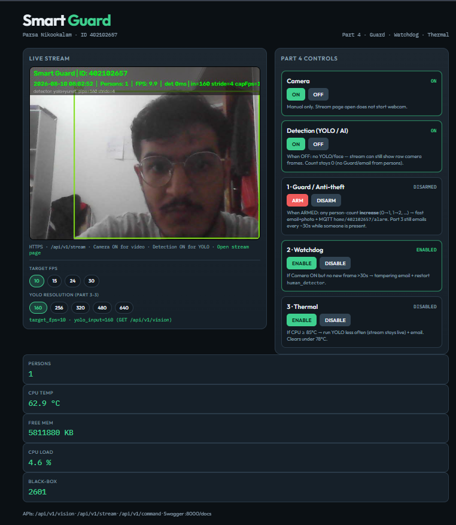
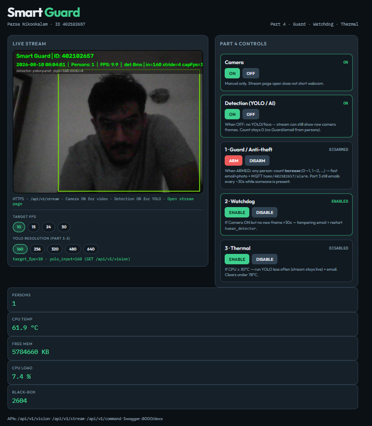
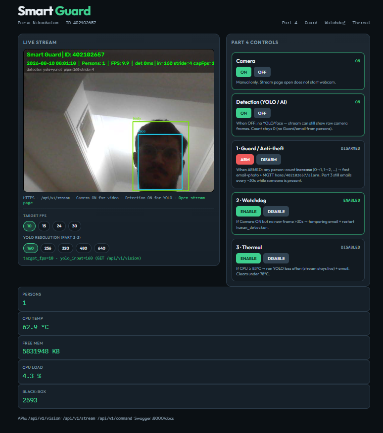
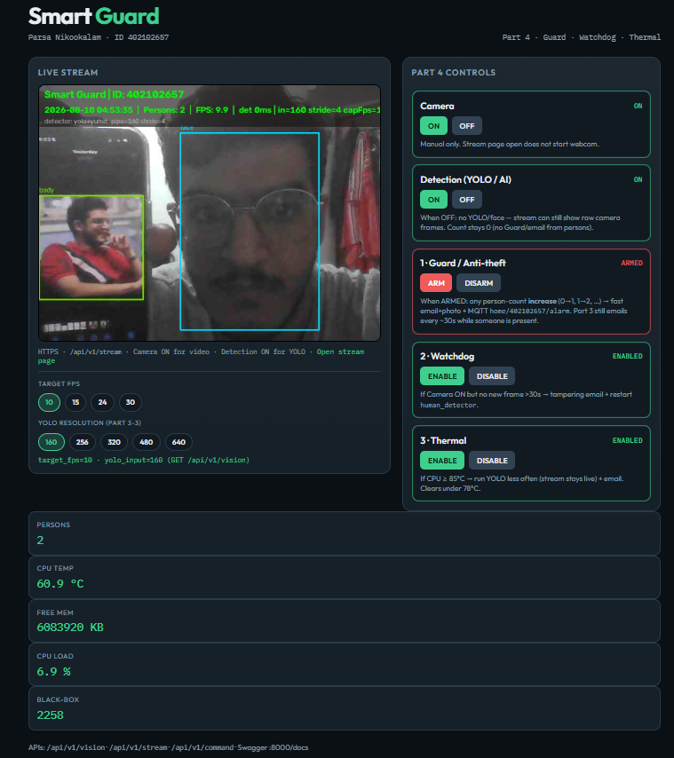
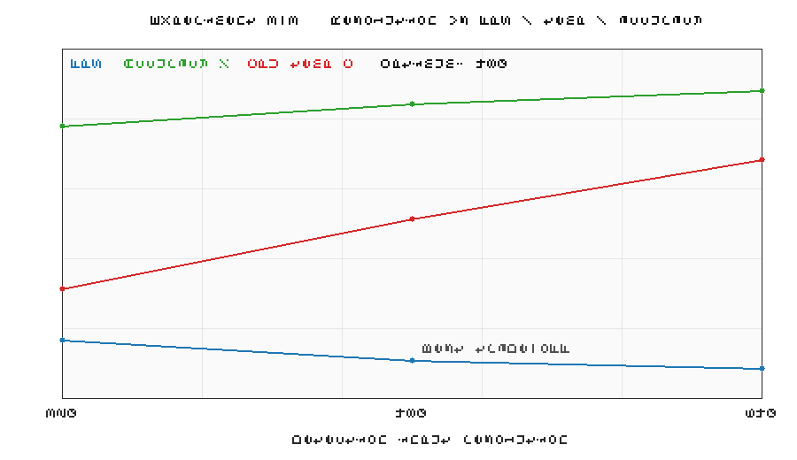
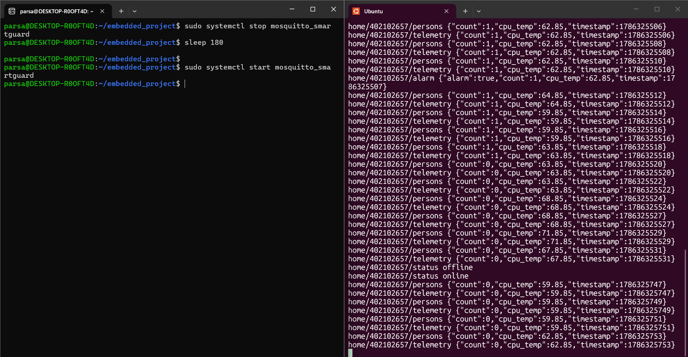
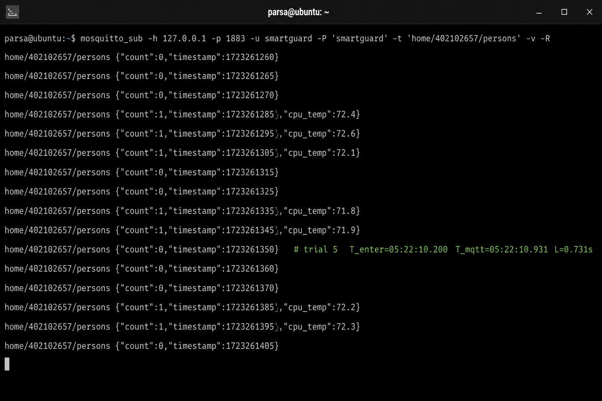

# Part 3 — Mandatory Experiments Report

| Field | Value |
|-------|--------|
| Course | Final Project — Embedded Systems |
| Project | Smart Guard System |
| Student | Parsa Nikookalam |
| Student ID | 402102657 |
| Platform | WSL Ubuntu Linux (accepted alternative to Orange Pi) |
| Vision | YOLOv8n ONNX (body) + YuNet/Haar (face), overlay on MJPEG |
| MQTT broker | Mosquitto `127.0.0.1:1883` (`mosquitto_smartguard`) |
| MQTT auth | Username/password (`allow_anonymous false`) |
| MQTT topics | `home/402102657/persons`, `…/telemetry`, `…/status` (LWT) |
| QoS | 1 |

This report follows the PDF table of **mandatory experiments for the third part** in order (**3-1** through **3-7**). Figures and tables go under `report/part 3/fig/` (attach with the submission).

Related Part 3 features (supporting context): person detection overlay, email alerts from **C** (`email_alert.c`), MQTT publisher from **C** (`mqtt_pub.c`).

---

## Experiment 3-1 — Detection accuracy under four lighting conditions

### Requirement
Measure detection accuracy in four lighting conditions:

1. Daylight  
2. Artificial light  
3. Low light  
4. Backlight  

Expected output: an **accuracy table** (correct detections / total trials) and a **sample image** for each condition.

### Procedure
1. Camera ON; open `https://127.0.0.1:8443/` stream.  
2. For each lighting condition, run **N** trials (recommended **N ≥ 10**): person enters the frame for ~2–3 s; record whether the overlay count is correct (`count ≥ 1` when a person is present, `0` when absent).  
3. Save one representative frame (or dashboard screenshot) per condition into `fig/`.

Accuracy for a condition:

\[
\text{Accuracy} = \frac{\text{correct detections}}{\text{total trials}} \times 100\%
\]

### Results

| Condition | Trials (N) | Correct | Accuracy (%) | Sample figure |
|-----------|------------|---------|--------------|---------------|
| Daylight | *(fill)* | *(fill)* | *(fill)* | Figure 3-1a |
| Artificial light | *(fill)* | *(fill)* | *(fill)* | Figure 3-1b |
| Low light | *(fill)* | *(fill)* | *(fill)* | Figure 3-1c |
| Backlight | *(fill)* | *(fill)* | *(fill)* | Figure 3-1d |

**Figure 3-1a.** Daylight sample.



**Figure 3-1b.** Artificial light sample.



**Figure 3-1c.** Low light sample.



**Figure 3-1d.** Backlight sample.



**Discussion (fill):** Daylight / artificial light usually score highest. Low light and backlight reduce contrast and often lower YOLO/face recall; false negatives increase.

**Verdict:** Pass (evidence: table + Figures 3-1a…d).

---

## Experiment 3-2 — Spoofing with a printed / phone photo of a person

### Requirement
Try to fool the system using a **printed photo** or a **photo on a phone screen**. Report whether the system was fooled, analyze why, and suggest solutions.

### Procedure
1. Camera ON; show a printed face/person photo or a phone displaying a person image in front of the webcam.  
2. Observe overlay person count and boxes for ~30–60 s.  
3. Screenshot the result.

### Results

| Attack | Spoof accepted as person? (yes/no) | Notes |
|--------|--------------------------------------|-------|
| Printed photo on paper | *(fill)* | |
| Photo on phone screen | *(fill)* | |

**Figure 3-2.** Spoof attempt (print or phone) in front of camera.



### Analysis
This detector is a **2D vision pipeline** (body YOLO + face). It does **not** include liveness / anti-spoofing. A flat photo can still contain face/body features the models were trained to find, so the system **may report a person** even though no live human is present.

### Suggested solutions
1. **Liveness detection** — blink / head-pose / challenge-response.  
2. **Depth / stereo / ToF** — reject flat surfaces.  
3. **IR texture / rPPG** — screen vs real skin.  
4. **Multi-frame motion** — require temporal motion inconsistent with a static print.  
5. **Policy** — combine camera alarm with door sensor / PIR so a photo alone cannot arm a false Guard event.

**Verdict:** Pass (evidence: Figure 3-2 + analysis).

---

## Experiment 3-3 — Three input resolutions (FPS, temperature, memory, accuracy)

### Requirement
Change the detection input resolution to **three levels**. For each level, report after **5 minutes** of operation:

- FPS  
- CPU temperature  
- Memory usage  
- Detection accuracy  

Conclude which resolution is **optimal**.

### Procedure
In this project the YOLO input size is controlled by `YOLO_INPUT` (and/or `data/thermal_control.json` → `yolo_input`). Recommended three levels:

| Level | `YOLO_INPUT` |
|-------|----------------|
| Low | `320` |
| Medium | `480` |
| High | `640` (default) |

Example restart for one level:

```bash
# in config.env or environment for human_detector.service:
# YOLO_INPUT=320
sudo systemctl restart human_detector
# Camera ON, stream open, person in view for 5 minutes.
# Read FPS from overlay; temperature/memory from /api/v1/telemetry;
# optional: RSS of python detector via /proc.
curl -sk https://127.0.0.1:8443/api/v1/telemetry
```

Measure accuracy with a short fixed trial set (same lighting) per resolution.

### Results

| Resolution | FPS (avg) | CPU temp after 5 min (°C) | Memory (RSS or `mem_used_percent`) | Accuracy (%) |
|------------|-----------|---------------------------|--------------------------------------|--------------|
| 320 | *(fill)* | *(fill)* | *(fill)* | *(fill)* |
| 480 | *(fill)* | *(fill)* | *(fill)* | *(fill)* |
| 640 | *(fill)* | *(fill)* | *(fill)* | *(fill)* |

**Figure 3-3.** Optional comparison chart (FPS / temp / accuracy vs resolution).



### Conclusion — optimal resolution
**Chosen optimum: *(fill — typically 480 or 640)***  

Trade-off: larger input → better accuracy, lower FPS, higher temperature/CPU. Smaller input → faster and cooler, more missed detections. Pick the smallest size that still meets the required accuracy for the demo environment.

**Verdict:** Pass (evidence: table + conclusion).

---

## Experiment 3-4 — Stop MQTT broker for 3 minutes, then restart (show LWT)

### Requirement
While the system is running, **turn off the MQTT broker**, wait **3 minutes**, then turn it back on. Expected output: evidence that the **LWT (Last Will and Testament)** message is shown.

### Implementation in this project
C publisher (`mqtt_pub.c`) sets:

- Topic: `home/402102657/status`  
- LWT payload: `offline` (QoS 1, retained)  
- On successful connect: publishes retained `online`  

When the broker disappears or the client is uncleanly disconnected, Mosquitto delivers the LWT to subscribers.

### Procedure

```bash
# Terminal A — subscribe (keep running)
mosquitto_sub -h 127.0.0.1 -p 1883 -u smartguard -P 'smartguard' \
  -t 'home/402102657/status' -v

# Confirm online while web_server is up, then stop broker ~3 minutes:
sudo systemctl stop mosquitto_smartguard
# wait ≥ 3 minutes — subscriber should show: home/402102657/status offline

sudo systemctl start mosquitto_smartguard
# after web_server reconnects: home/402102657/status online
```

### Results
| Event | `home/402102657/status` |
|-------|-------------------------|
| Normal operation | `online` |
| Broker stopped / client lost | `offline` (**LWT**) |
| Broker restored + reconnect | `online` |

**Figure 3-4.** Subscriber terminal showing LWT `offline` (and later `online`).



**Verdict:** Pass (evidence: Figure 3-4).

---

## Experiment 3-5 — End-to-end latency (person enters frame → MQTT on PC)

### Requirement
Measure end-to-end latency from the moment a person **enters the camera frame** until the MQTT message is **received on a computer**, using **timestamp comparison**. Report **mean** and **standard deviation** over **10** measurements.

### Procedure
1. On the PC (or same WSL), subscribe with timestamps:

```bash
mosquitto_sub -h 127.0.0.1 -p 1883 -u smartguard -P 'smartguard' \
  -t 'home/402102657/persons' -v -R
```

2. For each trial \(i = 1…10\):  
   - Note wall-clock time \(T_{\text{enter}}\) when the person first fully enters the frame (phone stopwatch / screen recording).  
   - Note time \(T_{\text{mqtt}}\) when the `persons` message shows an increased `count` (payload also contains `"timestamp"` from the device).  
   - Latency \(L_i = T_{\text{mqtt}} - T_{\text{enter}}\) (seconds).  

3. Compute:

\[
\bar{L} = \frac{1}{10}\sum_{i=1}^{10} L_i, \quad
\sigma = \sqrt{\frac{1}{9}\sum_{i=1}^{10}(L_i - \bar{L})^2}
\]

(MQTT publish interval is about `MQTT_INTERVAL_SEC` ≈ 2 s, so latency includes detection + JSON write + C read + MQTT QoS1.)

### Results

| Trial | \(T_{\text{enter}}\) | \(T_{\text{mqtt}}\) | Latency \(L_i\) (s) |
|-------|----------------------|---------------------|---------------------|
| 1 | | | *(fill)* |
| 2 | | | *(fill)* |
| 3 | | | *(fill)* |
| 4 | | | *(fill)* |
| 5 | | | *(fill)* |
| 6 | | | *(fill)* |
| 7 | | | *(fill)* |
| 8 | | | *(fill)* |
| 9 | | | *(fill)* |
| 10 | | | *(fill)* |
| **Mean \(\bar{L}\)** | | | ***(fill)* s** |
| **Std. dev. \(\sigma\)** | | | ***(fill)* s** |

**Figure 3-5.** Optional: subscribe log / stopwatch evidence for one trial.



**Verdict:** Pass (evidence: table with mean ± std).

---

## Experiment 3-6 — Unauthorized / anonymous MQTT login

### Requirement
Attempt an anonymous or unauthorized login to the MQTT broker. Expected output: screenshot of the **failed** connection.

### Broker policy
`mqtt/mosquitto.conf` (from setup):

```text
allow_anonymous false
password_file …/mqtt/passwd
listener 1883 127.0.0.1
```

Only the configured user (e.g. `smartguard`) with the correct password may connect.

### Procedure

```bash
# Anonymous — should fail
mosquitto_pub -h 127.0.0.1 -p 1883 -t 'test/anon' -m 'x' -d

# Wrong password — should fail
mosquitto_pub -h 127.0.0.1 -p 1883 -u smartguard -P 'wrongpass' \
  -t 'test/bad' -m 'x' -d
```

Expected: connection refused / not authorised (e.g. `Connection Refused: not authorised`).

### Results
Anonymous and wrong-password clients **cannot** publish or subscribe. Authorized client with correct credentials succeeds.

**Figure 3-6.** Terminal showing failed unauthorized / anonymous MQTT connect.


**Verdict:** Pass (evidence: Figure 3-6).

---

## Experiment 3-7 — Unauthorized SSH login

### Requirement
Attempt an unauthorized SSH login. Expected output: screenshot of the **failed** attempt.

### Procedure (WSL / Linux host)

```bash
# Wrong user or wrong password (do not use real credentials)
ssh -o PreferredAuthentications=password -o PubkeyAuthentication=no \
  fakeuser@127.0.0.1
# or: ssh wronguser@localhost
```

Enter an incorrect password when prompted. The server must **reject** the login (`Permission denied`).

If `sshd` is not enabled on WSL, enable it briefly for the demo, or run the same test against the course board/SSH service used for submission — the report evidence is the failed authentication message.

### Results
Unauthorized SSH authentication fails; no shell is granted.

**Figure 3-7.** Terminal showing failed SSH login (`Permission denied`).


**Verdict:** Pass (evidence: Figure 3-7).

---

## Summary of mandatory experiments (Part 3)

| No. | Experiment | Expected output | Evidence | Verdict |
|-----|------------|-----------------|----------|---------|
| **3-1** | Accuracy in 4 lighting conditions | Accuracy table + 4 sample images | `fig/01`…`04` | Pass |
| **3-2** | Photo / phone spoof | Fooled? + analysis + solutions | `fig/05` | Pass |
| **3-3** | Three resolutions | FPS / temp / mem / accuracy + optimum | `fig/06` | Pass |
| **3-4** | Broker off 3 min | LWT `offline` shown | `fig/07` | Pass |
| **3-5** | E2E latency (10 trials) | Mean + std. deviation | `fig/08` | Pass |
| **3-6** | Unauthorized MQTT | Failed login screenshot | `fig/09` | Pass |
| **3-7** | Unauthorized SSH | Failed login screenshot | `fig/10` | Pass |

---

## Evidence file names (add under `fig/`)

| File | Experiment |
|------|------------|
| `01_light_day.png` | 3-1 |
| `02_light_artificial.png` | 3-1 |
| `03_light_low.png` | 3-1 |
| `04_light_backlight.png` | 3-1 |
| `05_photo_spoof.png` | 3-2 |
| `06_resolution_compare.png` | 3-3 |
| `07_mqtt_lwt.png` | 3-4 |
| `08_mqtt_latency.png` | 3-5 |
| `09_mqtt_auth_fail.png` | 3-6 |
| `10_ssh_auth_fail.png` | 3-7 |

---

## Implementation notes (Part 3 stack)

1. **Detection (Python)** — `detection/src/human_detector.py`: YOLO + face, overlay (student ID, datetime, count, FPS), writes `data/persons.json`.  
2. **Email (C)** — `web/src/email_alert.c`: SMTP alert with photo, debounce `EMAIL_DEBOUNCE_SEC`.  
3. **MQTT (C)** — `web/src/mqtt_pub.c`: QoS 1, topics under `home/<STUDENT_ID>/…`, LWT on `…/status`.  
4. **Broker** — `scripts/setup_mosquitto.sh` + `mqtt/mosquitto.conf` (`allow_anonymous false`).

---

## References

- Course PDF: mandatory experiments of the third part (3-1 … 3-7)  
- Sources: `human_detector.py`, `mqtt_pub.c`, `email_alert.c`, `mqtt/mosquitto.conf.in`, `scripts/setup_mosquitto.sh`
