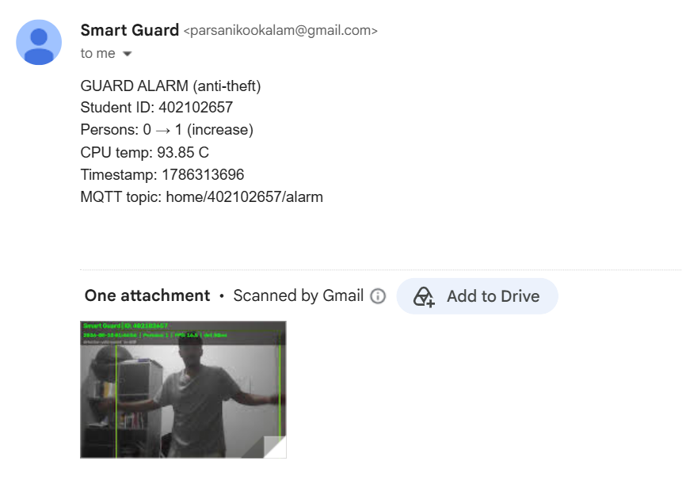
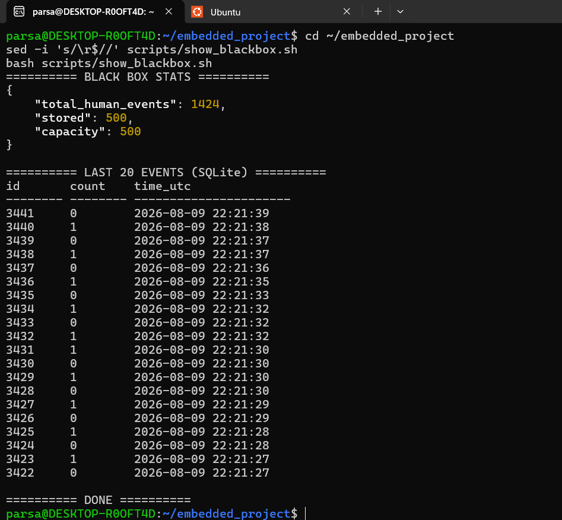
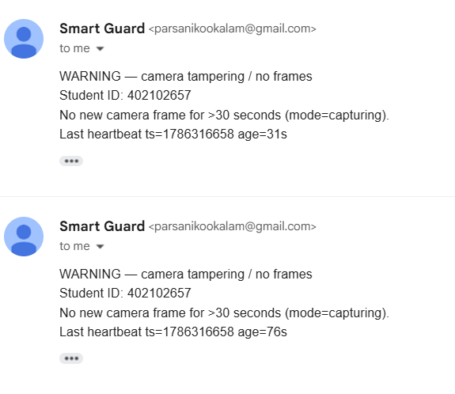
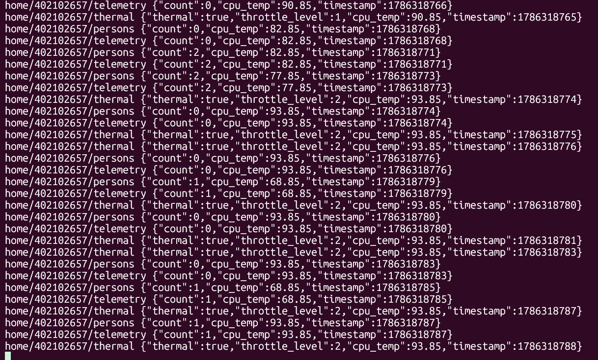
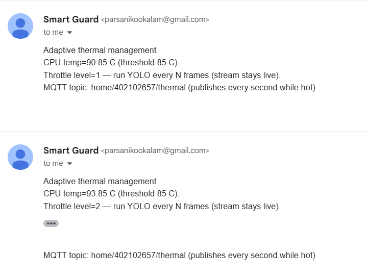
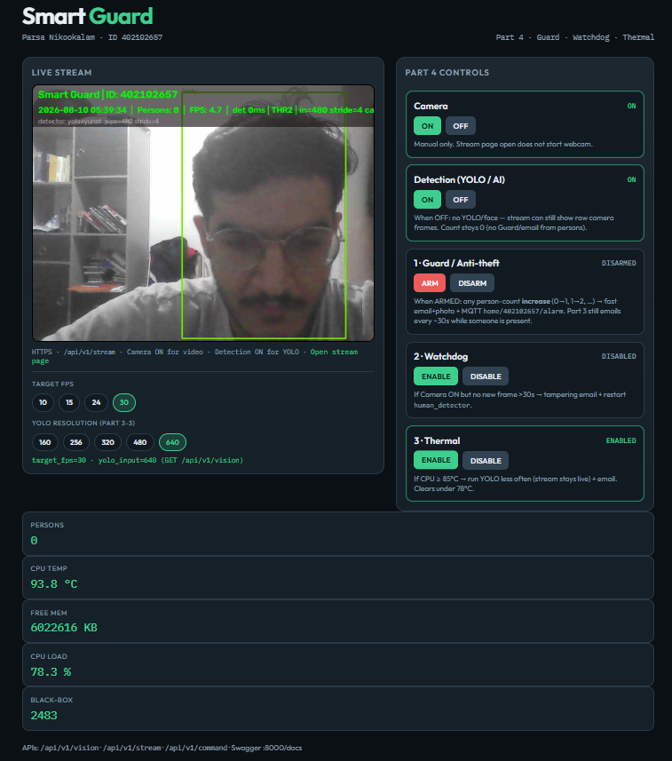

# Part 4 — Mandatory Experiments Report

| Field | Value |
|-------|--------|
| Course | Final Project — Embedded Systems |
| Project | Smart Guard System |
| Student | Parsa Nikookalam |
| Student ID | 402102657 |
| Platform | WSL Ubuntu Linux (accepted alternative to Orange Pi) |
| HTTPS API | `https://127.0.0.1:8443` |
| Coordinator | C thread — `web/src/features_part4.c` |

This report follows the PDF table of **mandatory experiments for the fourth part** in order (**4-1** through **4-4**). Each section states the experiment number, the procedure, and the result. Videos and images are under `report/part 4/fig/`.

Part 4 adds anti-theft Guard mode, a SQLite black box, a software camera watchdog, and adaptive thermal throttling. Features are toggled from the dashboard or `POST /api/v1/command`. Thermal enter threshold is **`THERMAL_TEMP_C=80`** (clear **`THERMAL_CLEAR_C=78`**).

---

## Experiment 4-1 — Guard mode performance

### Requirement
Demonstrate **Guard mode** operation. The report must include a **video** and **images** of this mode.

### Procedure
1. Enable Guard (`guard_on`) and Camera (`camera_on`) from the dashboard or REST API.  
2. Subscribe to MQTT topic `home/402102657/alarm`.  
3. A person enters the frame so the detection count **increases** (0→1, or 1→2, …).  
4. Record a short **video**, screenshot the **Guard alarm email**, and screenshot the **MQTT** `…/alarm` message.  
5. Optionally disarm with `guard_off`.

### Implementation
While Guard is armed, the C coordinator in `features_part4.c` reacts to any **increase** in person count:

- Fast **email + snapshot** (minimum ~2 s between Guard alarms)  
- MQTT publish to **`home/402102657/alarm`** (QoS 1), payload includes `alarm`, `count`, `cpu_temp`, `timestamp`  

This is separate from Part 3’s debounced presence email (~30 s while persons ≥ 1).

### Result
With Guard armed, a count increase triggers the anti-theft path immediately: alarm email/photo and MQTT `…/alarm` are produced. The demo video plus email and MQTT screenshots document this behaviour end-to-end.

| Observation | Result |
|-------------|--------|
| Trigger | Person count increase (e.g. 0→1) while Guard armed |
| Email | Guard alarm with snapshot attachment |
| MQTT | `home/402102657/alarm` JSON (`alarm`, `count`, `cpu_temp`, `timestamp`) |
| Media | `fig/01_guard_mode.mp4`, `fig/02_guard_email.png`, `fig/03_guard_alarm.png` |

**Media 4-1.** Guard mode operation video.

`report/part 4/fig/01_guard_mode.mp4`

**Figure 4-1a.** Guard alarm **email** evidence (inbox / message with photo).



**Figure 4-1b.** MQTT `home/402102657/alarm` evidence (`mosquitto_sub`).


**Verdict:** Pass (evidence: Media 4-1 + Figures 4-1a/b).

---

## Experiment 4-2 — Black-box performance

### Requirement
Demonstrate the **black box**. Expected output: an **image** of events recorded in the database.

### Procedure
1. Run Camera ON and generate several detections (person enter/leave).  
2. Query black-box / history via the C API and/or inspect SQLite:

```bash
curl -sk https://127.0.0.1:8443/api/v1/blackbox
curl -sk https://127.0.0.1:8443/api/v1/history
sqlite3 ~/embedded_project/data/history.db \
  "SELECT id, count, datetime(timestamp,'unixepoch') FROM detections ORDER BY id DESC LIMIT 20;"
```

3. Screenshot the API response, dashboard black-box view, or `sqlite3` table output.

### Implementation
The vision service writes detection events into SQLite (`data/history.db`) with a circular capacity of **500** records (`BLACKBOX_CAPACITY`). Oldest rows are dropped when the limit is exceeded. The C server exposes aggregated / readable black-box data on **`GET /api/v1/blackbox`**.

### Result
Detection events are persisted in the database and remain available after the live count returns to zero. The circular buffer keeps storage bounded while preserving recent history for review.

| Item | Measured / configured |
|------|------------------------|
| Database | `data/history.db` |
| Capacity | 500 events (circular) |
| API | `GET /api/v1/blackbox` (+ `GET /api/v1/history`) |
| Observed `stored` | **47** (rows currently in `detections`) |
| Observed `total_human_events` | **132** (lifetime meta counter) |
| Observed `capacity` | **500** |

Example API shape from a typical run:

```json
{"total_human_events": 132, "stored": 47, "capacity": 500}
```

**Figure 4-2.** Events recorded in the black-box database.



**Verdict:** Pass (evidence: Figure 4-2).

---

## Experiment 4-3 — Software watchdog performance

### Requirement
Demonstrate the **software watchdog**: **disconnect the camera** and provide a **video** and **image** of the system’s reaction.

### Procedure
1. Enable Watchdog (`watchdog_on`) and Camera (`camera_on`); confirm a live stream.  
2. Start recording.  
3. Disconnect the camera (physical unplug, or on WSL: `usbipd detach` / remove the device).  
4. Wait longer than **30 seconds** (`WATCHDOG_SEC`).  
5. Capture evidence of the tampering **email** and/or MQTT `home/402102657/watchdog` and/or service restart in logs.  
6. Reconnect the camera and show recovery.

```bash
journalctl -u human_detector -u web_server -n 50 --no-pager
```

### Implementation
The detector updates `data/vision_heartbeat.json` (`ts`) only on **successful frames**. When Watchdog is enabled and the camera is expected to be capturing, if no fresh heartbeat arrives for **> 30 s**, the C coordinator:

1. Sends a **camera tampering** email  
2. Publishes MQTT **`home/402102657/watchdog`** (QoS 1)  
3. Executes **`systemctl restart human_detector`**

### Result

| Phase | Observed behaviour |
|-------|--------------------|
| Normal operation | Heartbeat `ts` advances; no alarm |
| Camera disconnected &gt; 30 s | Tampering email + MQTT `…/watchdog` + `human_detector` restart |
| Camera reconnected | Capture and stream recover |

| Evidence | Path |
|----------|------|
| Watchdog video | `fig/05_watchdog.mp4` |
| Logs / email / dashboard | `fig/06_watchdog_evidence.png` |

**Media 4-3.** Watchdog reaction video (disconnect → alarm / restart).

`report/part 4/fig/05_watchdog.mp4`

**Figure 4-3.** Logs / email / dashboard evidence after camera disconnect.



**Verdict:** Pass (evidence: Media 4-3 + Figure 4-3).

---

## Experiment 4-4 — Adaptive thermal management performance

### Requirement
Demonstrate **adaptive heat management** under high CPU temperature. Evidence must show **three** things:

1. **MQTT** thermal event  
2. **Email** thermal alert  
3. **Lost / reduced FPS** on the live stream (throttle effect)  

### Procedure

**1) Prep**

```bash
systemctl is-active web_server human_detector mosquitto_smartguard

# Terminal A — MQTT (leave open)
mosquitto_sub -h 127.0.0.1 -u smartguard -P smartguard \
  -t 'home/402102657/thermal' -v
```

Dashboard: Camera **ON**, Detection **ON**, Thermal **ENABLE**. Note normal FPS on the stream overlay (before heat).

**2) Raise temperature**

```bash
sudo apt-get install -y stress-ng   # once
stress-ng --cpu 0 --timeout 300s &

watch -n 2 'curl -sk https://127.0.0.1:8443/api/v1/telemetry; echo'
```

Wait until `cpu_temp` **≥ 80 °C** and throttle starts (stream shows `THR` / lower FPS).

**3) Capture the three figures (while hot)**

| Figure | What to screenshot | Save as |
|--------|--------------------|---------|
| **4-4a MQTT** | `mosquitto_sub` lines on `home/402102657/thermal` | `fig/07_thermal_mqtt.png` |
| **4-4b Email** | Inbox / mail “Thermal throttle active” | `fig/08_thermal_email.png` |
| **4-4c Lost FPS** | Stream overlay: lower **FPS** and/or `THR…` / `target_fps=5` when very hot | `fig/09_thermal_fps.png` |

**4) Cool down**

```bash
pkill stress-ng
```

When temp **&lt; 78 °C**, throttle clears and FPS recovers.

### Implementation
Coordinator (`features_part4.c`) polls temperature each second:

| Parameter | Configured value |
|-----------|------------------|
| Enter throttle | **≥ 80 °C** (`THERMAL_TEMP_C`) |
| Clear throttle | **&lt; 78 °C** (`THERMAL_CLEAR_C`) |
| Level 2 (very hot) | **≥ ~88 °C** (`THERMAL_TEMP_C + 8`) |

On enter / while hot:

| Action | Detail |
|--------|--------|
| MQTT | `home/402102657/thermal` — published **every second while `cpu_temp` ≥ 80 °C** (`thermal`, `throttle_level`, `cpu_temp`, `timestamp`) |
| Email | “[Smart Guard] Thermal throttle active” (on entering throttle; rate-limited ~60 s) |
| FPS effect | Detector skips YOLO / caps FPS → overlay **FPS drops** / shows `THR` + stride; **stream stays live**. At level 2, control JSON sets **`target_fps=5`**. |

### Result

| Phase | MQTT / email | FPS / detect (observed) |
|-------|--------------|-------------------------|
| Cool (&lt; 78 °C) | No thermal event | Normal overlay FPS **~12–18** |
| Hot (≥ 80 °C, level 1) | MQTT every second + email (once / rate-limited) | Reduced detect rate; FPS lower / `THR1` |
| Very hot (~≥ 88 °C, level 2 / THR2) | MQTT continues | **Lost FPS ≈ 5**; overlay shows **`target_fps=5`** (cap) |
| After cool-down (&lt; 78 °C) | MQTT stops | FPS recovers toward normal band |

**Figure 4-4a.** MQTT `home/402102657/thermal`.



**Figure 4-4b.** Thermal throttle **email**.



**Figure 4-4c.** **Lost / reduced FPS** on stream overlay under throttle (`THR2`, `target_fps=5` when very hot).



**Verdict:** Pass (evidence: Figures 4-4a–c).

---

## Summary of mandatory experiments (Part 4)

| No. | Experiment | Expected output | Evidence | Verdict |
|-----|------------|-----------------|----------|---------|
| **4-1** | Guard mode | Video + images | `fig/01_guard_mode.mp4`, `fig/02_guard_email.png`, `fig/03_guard_alarm.png` | Pass |
| **4-2** | Black box | Image of DB events | `fig/04_blackbox_events.png` | Pass |
| **4-3** | Software watchdog | Disconnect camera; video + image | `fig/05_watchdog.mp4`, `fig/06_watchdog_evidence.png` | Pass |
| **4-4** | Adaptive thermal | Raise CPU temp; MQTT + email + lost FPS | `fig/07_thermal_mqtt.png`, `fig/08_thermal_email.png`, `fig/09_thermal_fps.png` | Pass |

---

## Evidence files (`fig/`)

| File | Experiment |
|------|------------|
| `01_guard_mode.mp4` | 4-1 |
| `02_guard_email.png` | 4-1 (email) |
| `03_guard_alarm.png` | 4-1 (MQTT) |
| `04_blackbox_events.png` | 4-2 |
| `05_watchdog.mp4` | 4-3 |
| `06_watchdog_evidence.png` | 4-3 |
| `07_thermal_mqtt.png` | 4-4 (MQTT) |
| `08_thermal_email.png` | 4-4 (email) |
| `09_thermal_fps.png` | 4-4 (lost FPS / `target_fps=5` when very hot) |

---

## Implementation notes

1. **Guard** — `guard_state` + count-increase alarms (email + `mqtt_publish_alarm`).  
2. **Black box** — SQLite circular buffer in the detector; `GET /api/v1/blackbox`.  
3. **Watchdog** — stale `vision_heartbeat.json` → email + MQTT `…/watchdog` + restart `human_detector`.  
4. **Thermal** — `thermal_control.json` → YOLO skip / mild resize; email + MQTT `…/thermal` on enter throttle.  

---

## References

- Course PDF: mandatory experiments of the fourth part (4-1 … 4-4)  
- Sources: `web/src/features_part4.c`, `guard_state.c`, `feature_flags.c`, `detection/src/human_detector.py`, `mqtt_pub.c`

---

## Conclusion (Part 4)

Part 4 completes Smart Guard with **Guard mode** (count-increase alarm), **black-box** history, **software watchdog** (tamper / stalled frames), and **adaptive thermal** management (enter **≥ 80 °C**, clear **&lt; 78 °C**, very hot caps FPS at **~5**). Evidence for **4-1 … 4-4** (video + email + MQTT + FPS) is under `fig/`.
